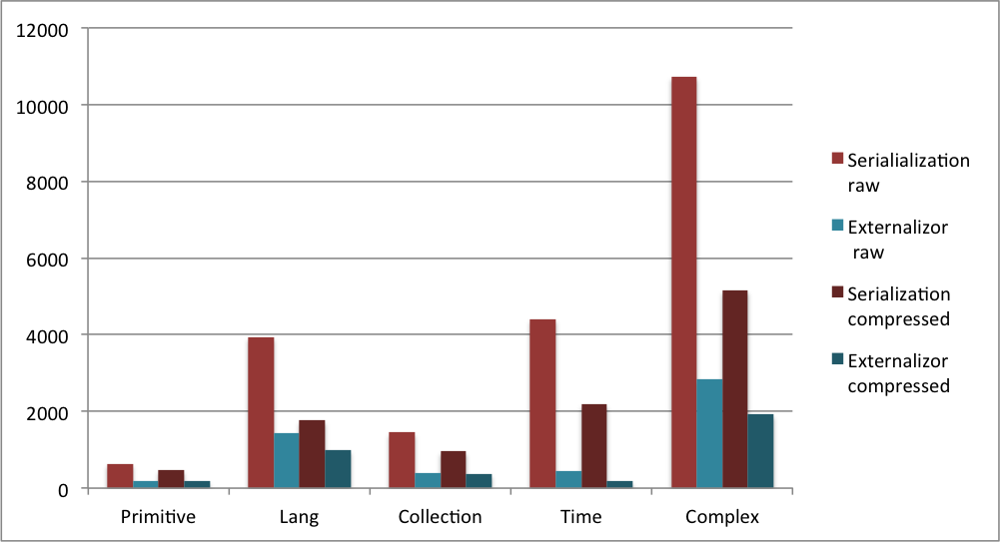
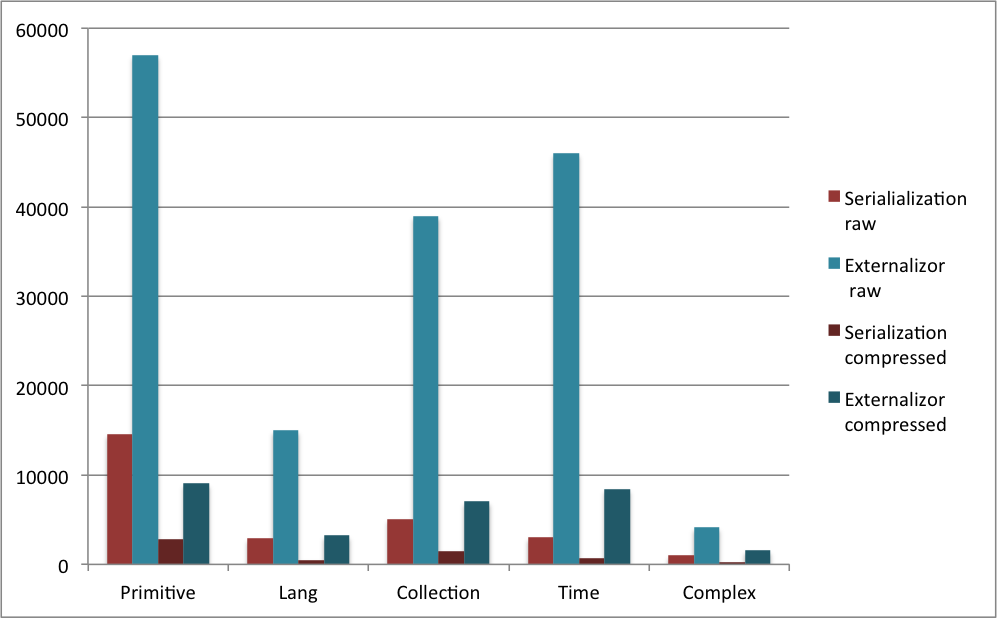

# Externalizor

[](https://travis-ci.org/qwazr/externalizor)
[](https://maven-badges.herokuapp.com/maven-central/com.qwazr/externalizor)
[](https://coveralls.io/github/qwazr/externalizor?branch=master)
[](http://www.javadoc.io/doc/com.qwazr/externalizor)

Efficient (fast and small) Java serialization using Externalizable interface.

- Support of Externalizable objects
- Concrete Collections (Map, Set, Vector, List) with compression/decompression based on [Snappy](https://github.com/xerial/snappy-java)
- Primitive types: int, long, short, double, float, boolean, char, byte, enum
- Primitive array: with compression/decompression based on [Snappy](https://github.com/xerial/snappy-java)
- Time types: Date, LocalDate, LocalTime, LocalDateTime, Instant, Duration, Period, MonthDay, Year
- Overall serialization with Snappy

## Usage

The class to serialize should implements
[Externalizable](https://docs.oracle.com/javase/8/docs/api/java/io/Externalizable.html).

### The simplest way

The classes which are supposed to be serialized can extends AutoExternalizor.

```java

import com.qwazr.externalizor.AutoExternalizor;

public class MyClass extends AutoExternalizor {

	String aStringValue;
	int anIntValue;
	double[] anArrayOfDouble;

	enum MyEnum {
		on, off
	}

	MyEnum anEnum;
	HashSet<Status> aSetOfEnum;

	public MyClass() {
	}

}
```

### The more efficient way

The Externalizor object which is in charge of serializing/deserializing the class is static.
The class itself implements the Externalizable methods using the static externalizor instance.

```java

import java.io.Externalizable;
import com.qwazr.externalizor.Externalizor;

public class MyClass implements Externalizable {

	String aStringValue;
	int anIntValue;
	double[] anArrayOfDouble;

	enum MyEnum {
		on, off
	}

	MyEnum anEnum;
	HashSet<Status> aSetOfEnum;

	public MyClass() {
	}

	// Here is the serialization part:
    // Create the serialization handler for this class. 
	private final static Externalizor<MyClass> externalizor = Externalizor.of(MyClass.class);

	@Override
	public void writeExternal(final ObjectOutput out) throws IOException {
		externalizor.writeExternal(this, out);
	}

	@Override
	public void readExternal(final ObjectInput in) throws IOException, ClassNotFoundException {
		externalizor.readExternal(this, in);
	}
}
```

### Serialize / deserialize

Use the provided static methods to serialize and/or deserialize your object(s). 

```java

// Serialization with compression

MyClass myClass = new MyClass();
try (ByteArrayOutputStream output = new ByteArrayOutputStream()) {
    Externalizor.serialize(object, output);
}

// Deserialization with compression

try (ByteArrayInputStream input = new ByteArrayInputStream(bytes)) {
    MyClass myClass = Externalizor.deserialize(input);
}

// Serialization without compression

MyClass myClass = new MyClass();
try (ByteArrayOutputStream output = new ByteArrayOutputStream()) {
    Externalizor.serializeRaw(object, output);
}

// Deserialization without compression

try (ByteArrayInputStream input = new ByteArrayInputStream(bytes)) {
    MyClass myClass = Externalizor.deserializeRaw(input);
}
```

## Maven dependency

In Maven's central repository:
[central.maven.org/maven2/com/qwazr/externalizor](http://central.maven.org/maven2/com/qwazr/externalizor)

Add the following dependency to your pom.xml:

```xml
<dependency>
    <groupId>com.qwazr</groupId>
    <artifactId>externalizor</artifactId>
    <version>1.2</version>
</dependency>
```

## Benchmark

The code of the benchmark is here:
[BenchmarkTest](src/test/java/com/qwazr/externalizor/BenchmarkTest.java)

- Serialization raw: Default Java serialization without compression.
- Serialization compressed: Default Java serialization with Snappy compression.
- Externalizor raw: Using Externalizor without compression.
- Externalizor compressed: Using Externalizor with Snappy compression.

### Average size of the serialized objects

Bytes sizes. Smaller is better.



### Serialization/Deserialization rate

Number of serialization and deserialization per seconds. Bigger is better.



## Issues

Post bug reports or feature request to the Issue Tracker:
https://github.com/qwazr/externalizor/issues

## Open source license

[Apache2 license](https://github.com/qwazr/externalizor/blob/master/LICENSE)

